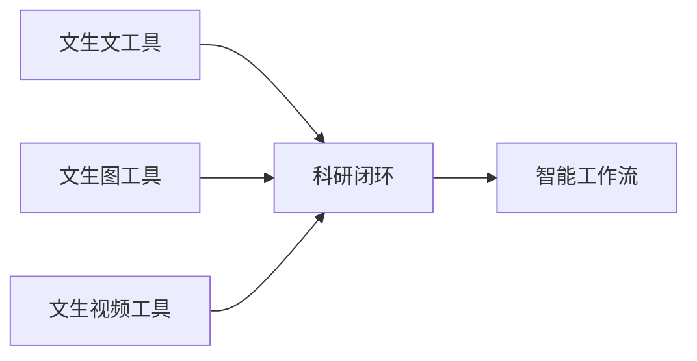

**工具组合**：

```mermaid
graph LR
A[文生文工具] --> D[科研闭环]
B[文生图工具] --> D
C[文生视频工具] --> D
D --> E[智能工作流]
```

**应用场景**：

1. 科研全链路协同（选题→写作→传播）
2. 智慧课堂构建（教学内容生成→课堂交互→学习评价）

**案例**：
《新能源汽车补贴政策效应评估》AI科研闭环（文献→数据可视化→视频展示）
