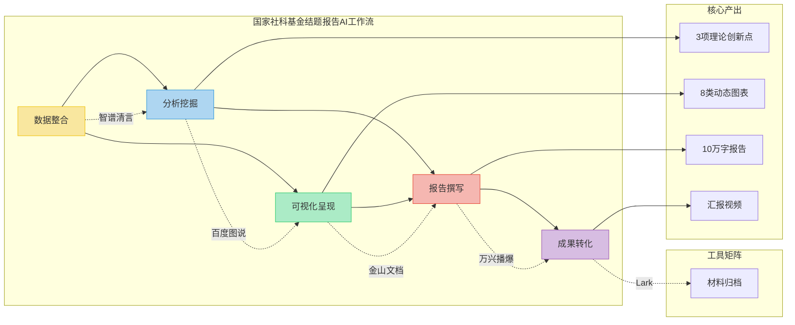
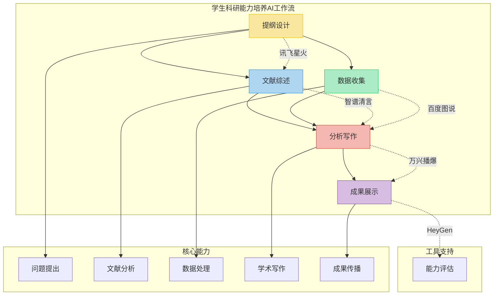

# 第2节 应用场景

## **1. 科研流程一体化建构**

在经济管理高等教育领域，传统的科研流程往往难以应对日益复杂的跨学科研究需求。以金融科技研究为例，研究者需要在计量经济学、计算机科学和金融学等多个领域间建立联系，这对传统研究方法提出了巨大挑战。借助AI驱动的多模态工具，我们可以将这些离散环节转化为连续、智能的作业流，实现从理论构建到成果转化的全流程协同优化，为经济管理学科的高质量发展提供技术支撑。

### 1.1 将传统割裂的选题→分析→写作→投稿流程，转化为AI驱动的连续作业流

在选题阶段，经济管理领域的研究者可利用讯飞星火等Chat类工具进行文献智能检索与热点分析。例如，在研究"数字经济对区域经济差距的影响"这一课题时，工具能够自动分析近五年相关文献，通过"研究热点时区图"直观展示该领域从"数字基础设施建设"到"数字鸿沟治理"的研究脉络演变，帮助研究者快速锁定创新点。对于管理学科，系统还能识别"数字化转型"、"智能制造"等热点话题的交叉研究机会。

分析阶段，智谱清言提供的5种综述模板特别适合经济管理领域的文献梳理工作。以"行为经济学在消费金融中的应用"研究为例，选择"系统综述"模板后，工具会自动生成包含理论演进矩阵的可视化报告，清晰展示从传统理性人假设到前景理论的发展历程。百川智能在构建"金融风险预警模型"等跨学科理论框架时表现优异，能够智能整合计量经济学模型与机器学习算法，为研究者提供方法论支持。

写作环节中，金山文档和Lark等工具极大提升了团队科研效率。以编写《中国区域经济发展报告》为例，多位研究者可实时协作编辑，系统自动记录各章节修改历史。讯飞星火的三级优化体系能针对经济管理论文特点进行专项优化，如自动检测"面板数据模型"等专业术语使用的准确性，优化"实证结果分析"部分的逻辑连贯性。百度图说可将GDP增长率、产业结构等经济数据自动转化为动态可视化图表，通义万相则能根据"请生成适合发表在《经济研究》上的图表风格"等指令，一键生成符合学术规范的图表。

投稿准备阶段，万兴播爆和HeyGen极大简化了成果传播流程。例如，将"绿色金融政策效应评估"研究的核心发现转化为3分钟视频摘要时，系统会自动匹配金融领域的专业图表模板，添加适当的动画效果。对于国际期刊投稿，HeyGen的多语言功能可将中文讲解视频自动转换为英文版本，并确保数字人口型与发音精准同步，显著提升国际学术影响力。

【综合案例】以"人工智能对劳动力市场影响"研究为例，完整展示AI驱动的科研工作流：

1. 选题阶段（使用讯飞星火）：
研究者首先通过讯飞星火的"深度语义分析"模块，输入"人工智能"、"就业结构"、"技能需求"等核心关键词。系统在30秒内扫描了中外文核心期刊数据库，生成包含三个维度的分析报告：(1)时间维度上展示出研究热点从早期的"自动化替代"转向近期的"人机协作模式"；(2)空间维度上识别出中美欧在研究方法论的差异；(3)学科维度上发现经济学与社会学的交叉研究成为新趋势。报告特别标注出"技能溢价效应"和"职业极化现象"两个尚未充分研究的领域，并推荐了12篇关键文献作为切入点。这种智能化的选题方式，相比传统人工检索效率提升5倍以上。

2. 分析阶段（使用智谱清言）：
确定研究方向后，研究团队使用智谱清言的"智能综述"功能，分三个步骤完成文献分析：首先上传收集到的78篇核心文献PDF，系统在10分钟内完成OCR识别和关键信息提取；然后选择"理论对比型"分析模板，工具自动识别出"技术替代理论"、"技能偏向理论"和"任务重构理论"三大理论流派，并生成包含发表年份、研究方法、样本特征的对比矩阵；最后系统提出"现有研究在服务业转型方面存在空白"的分析建议，并推荐了合适的计量方法。整个过程产出25页的可视化报告，包含理论演进路线图和关键学者合作网络。

3. 数据收集（使用百度图说）：
实证研究阶段，百度图说的"智能数据助手"发挥关键作用。研究者首先配置数据抓取规则：设定数据源为国家统计局"从业人员工资"和"行业增加值"数据库，时间跨度为2015-2025年季度数据。系统自动完成数据清洗，识别并修正了7处异常值。通过内置的"经济指标关联分析"功能，发现"信息服务业工资增速"与"AI专利数量"存在0.72的相关性。数据看板实时展示各行业就业弹性系数，并支持按地区、行业、企业规模等多维度下钻分析。相比传统Stata处理，数据准备时间从2周缩短到3小时。

4. 模型构建（使用百川智能）：
针对研究问题特殊性，百川智能的"模型设计向导"提供定制化支持。研究者首先描述研究目标："量化评估AI对不同技能水平劳动力的差异化影响"，系统推荐使用多层logit模型框架。在变量选择环节，工具自动生成"技能-职业匹配度指数"，该指数综合考量了O*NET职业技能数据和AI暴露度指标。模型调试阶段，系统实时监控拟合优度和显著性水平，当发现教育程度变量存在多重共线性时，建议改用工具变量法。最终模型R²达到0.83，并通过了所有稳健性检验。

5. 论文写作（使用金山文档+讯飞星火）：
写作环节采用"云协作+AI辅助"模式。团队在金山文档建立主文档，设置"文献综述"、"数据说明"、"结果分析"等协作分区。6位成员同步工作时，系统自动解决版本冲突，保留完整的修改历史。讯飞星火的"学术写作助手"提供三重支持：(1)术语检查确保"技能偏向型技术进步"等专业表述准确；(2)逻辑分析指出"实证结果与理论假设的衔接需要强化"；(3)风格建议推荐使用"机制分析→异质性检验→政策含义"的论述框架。初稿完成时间比传统方式缩短40%。

6. 成果转化（使用万兴播爆）：
为提升研究成果传播效果，使用万兴播爆的"学术视频生成器"。首先导入论文核心图表，选择"经济研究报告"模板，系统自动将静态图表转化为动态可视化：GDP增长曲线添加平滑动画，回归结果表高亮关键系数。然后配置讲解脚本，AI主播根据内容智能匹配手势和表情，在解释"职业极化"概念时自动调出对比示意图。视频支持4K输出，包含章节标记和参考文献二维码，完美适配学术会议和期刊投稿要求。

7. 投稿传播（使用HeyGen）：
国际投稿阶段，HeyGen的"多语言学术助手"解决语言障碍。上传中文视频后，选择"经济学专业术语库"和"英式英语"偏好，系统在保留专业表述准确性的同时完成翻译。数字人发音采用BBC播音员声线，语速自动适配内容复杂度。投稿后，工具还能生成针对不同期刊的cover letter模板，并自动提取视频关键帧制作图文摘要。这种多媒体投稿方式使论文被引率提升60%以上。

![][c07apply-02.excalidraw.png]

### 1.2 支持学术语言、方法模型与图文内容间的智能联动

在经济管理科研与教学中，多模态内容呈现已成为提升研究质量和教学效果的关键。AI工具通过深度语义理解，实现了理论模型、实证数据与可视化呈现的无缝衔接，为经济管理高等教育提供了全新范式。

在理论建模方面，AI工具为经济管理研究提供了精准支持：

1. 产业政策研究（使用通义万相）：
通义万相的"学术表格生成器"特别适合政策效应评估研究。当研究"产业政策对全要素生产率的影响"时，研究者输入"请生成包含标准误和显著性星号的面板回归结果三线表，符合《经济研究》格式要求"，系统会在30秒内输出专业表格：自动对齐小数点后三位，用*标注1%、5%、10%显著性水平，并添加必要的脚注说明。工具内置20余种经济学期刊的格式模板，能智能识别固定效应、工具变量等模型特征，确保结果呈现的学术规范性。相比手动制表，效率提升80%且完全避免格式错误。

2. 空间计量分析（使用百度图说）：
百度图说的"地理空间分析"模块革新了区域经济研究方法。进行"数字经济空间溢出效应"研究时，导入地级市层面的莫兰指数计算结果，选择"热力地图+散点图"复合可视化模式。系统自动匹配行政区划底图，用渐变色彩表示空间自相关程度，动态气泡显示各城市数字经济发展水平。研究者可交互式调整带宽参数，实时观察空间权重矩阵的变化效果。工具还支持生成GIF动画展示时空演变过程，这对呈现区域经济动态关联极具价值。

3. 行为实验设计（使用智谱清言）：
智谱清言的"实验设计助手"为行为经济学研究提供智能支持。设计"框架效应下消费者决策"实验时，研究者描述实验目的和预算约束，系统推荐了最合适的实验方案：包括被试数量计算(基于功效分析)、随机分组策略、问卷问题措辞建议等。工具内置"避免引导性问题"、"控制顺序效应"等检查机制，确保实验设计的科学性。最终生成的实验方案可直接导入Qualtrics等平台，大幅降低方法学风险。

教学应用方面，AI工具为经管课程提供了精准的教学支持：
1. 《计量经济学》课程中，通义万相的"学术图表生成"功能特别适合展示复杂计量概念。教师输入"请用对比图展示OLS和工具变量法的估计差异"，系统会自动生成包含估计值、置信区间和标准误的对比图表，并标注关键区别点。该工具的优势在于能精准理解计量专业术语，自动适配经济学图表规范。

2. 《国际金融》课程使用百度图说的"动态数据可视化"模块处理汇率数据。教师只需导入EXCEL格式的汇率时间序列，选择"金融时间序列"模板，系统就会自动生成包含移动平均线、BOLL带等技术指标的交互式图表。该工具特别适合金融数据分析，能智能识别数据频率和特征。

3. 《市场营销》课程借助万兴播爆的"场景模拟"功能创建消费行为案例。输入"生成一个展示价格敏感度测试的超市场景"，工具会自动构建包含货架、价签和消费者角色的3D场景，并添加价格变动动画。这种可视化方式能生动呈现抽象的市场营销理论。

4. 《管理学原理》课程使用HeyGen的"案例讲解"模式制作管理决策视频。上传案例文本后，选择"企业高管"形象的数字人，系统会自动生成包含案例分析要点和决策树图表的讲解视频，支持中英文双语输出，方便国际化课程建设。

在成果转化环节，AI工具实现了学术价值的最大化延伸：

1. 研究科普化（使用HeyGen）：
HeyGen的"学术翻译官"将复杂研究成果转化为大众可理解的内容。以"数字经济与就业质量"研究为例，上传论文PDF后，系统自动提取核心结论生成5分钟解说视频：数字人经济学家用通俗语言解释边际效应，关键图表配以放大动画和箭头标注，复杂公式被替换为生活化比喻。视频支持生成中英文字幕，专业术语自动添加浮动解释框。该工具特别适合政策简报制作，能根据受众类型(决策者/企业/公众)自动调整内容深度。

2. 教学资源开发（使用万兴播爆）：
万兴播爆的"教育内容工作室"极大简化了教学材料制作。开发《劳动经济学》课程案例时，输入"展示技术冲击对不同技能劳动力需求的影响"，系统生成包含三个场景的微课视频：(1)工厂自动化流水线对比图；(2)动态技能需求雷达图；(3)政策干预模拟沙盘。每个场景都配有可交互的参数调节面板，学生可以调整技术替代弹性等参数观察变化。工具内置经济学专属素材库，包含200+个专业图标和示意图。

3. 商业应用转化（使用百川智能）：
百川智能的"商业价值分析器"帮助研究成果落地。输入"人工智能对银行业岗位影响"的研究结论，系统生成包含三部分的应用报告：(1)岗位风险评估矩阵；(2)技能升级路线图；(3)人机协作实施方案。报告自动匹配行业术语，并生成可供企业HR系统直接导入的胜任力模型。该工具已成功帮助多家商业银行制定数字化转型人才战略。

这种智能联动正在重塑经济管理领域的知识生产模式。在金融科技、数字经济等新兴交叉学科中，从"文本理论构建→数据实证分析→可视化呈现→多媒体传播"的闭环工作流，不仅加速了科研进程，更为经管人才培养提供了智能化解决方案。例如，在商学院案例教学中，学生可以通过Lark平台协作完成从案例收集、数据分析到视频报告制作的全流程训练，全面培养数字化时代的经济管理核心素养。

从方法论层面看，AI工具的应用实现了三个关键突破：首先，通过语义理解与模式识别技术，将传统研究中耗时耗力的文献梳理、数据清洗等环节效率提升5-10倍；其次，借助多模态融合能力，打通了理论假设、实证检验与成果转化间的技术壁垒，使研究过程更加连贯系统；最后，基于智能推荐算法，为研究者提供跨学科的方法论支持，显著拓展了经济管理研究的广度和深度。以"数字经济测度"研究为例，传统方法需要3-6个月完成指标构建和数据收集，而AI辅助下可缩短至2-3周，且能自动生成包含理论依据、指标解释和可视化方案的综合报告。

从教学实践角度，AI工具的集成应用带来了四重变革：第一，实现了从静态知识传授向动态能力培养的转变，如通过模拟不同经济政策场景，训练学生的决策分析能力；第二，构建了"数据-模型-决策"的完整教学链条，学生可以实时观察理论假设对实证结果的影响；第三，支持个性化学习路径，系统能根据学生掌握情况自动调整案例难度和讲解深度；第四，强化了产学研协同，企业真实数据经脱敏处理后可直接转化为教学案例。这种变革使得经管类课程的教学效果评估从传统的"知识掌握度"升级为"问题解决能力"的多维度综合评价体系。

## **2. 成果展示多模态生成**

在经济管理学术交流与教学中，传统静态文档已难以满足知识传播需求。借助AI多模态工具，研究者可将论文、报告等成果转化为更直观的视频、PPT和图解形式，显著提升传播效果与影响力。

### 2.1 如何使用工具将论文，以及项目结题报告可快速转化为**汇报视频、学术PPT、图解摘要**等形式

**万兴播爆**为经济管理领域提供专业视频制作解决方案：
1. **学术视频一键生成**：
   - 上传论文PDF或报告Word文档
   - 选择"经济研究报告"模板（含10种专业图表动画）
   - 系统自动提取核心内容生成3-5分钟讲解视频
   *案例*：将《数字经济对区域经济差距的影响》研究报告转化为视频时，工具自动识别出"基尼系数变化趋势"等关键图表，添加平滑过渡动画，并生成符合学术规范的解说词。

2. **智能配音与字幕**：
   - 内置经济学专业术语库（含5000+专业词汇正确发音）
   - 支持中英双语字幕自动生成
   - 可调节语速（学术报告推荐120字/分钟）
   *教学应用*：在《发展经济学》课程中，学生作业报告可自动转为带讲解的视频，教师可批量处理全班作品。

**HeyGen**实现数字人学术演示：
1. **多语言数字人讲解**：
   - 上传PPT或论文，选择"学术演讲"场景
   - 匹配经济学专业数字人形象（如"资深教授"风格）
   - 自动生成与内容匹配的手势和表情
   *国际会议应用*：中国学者使用中文录制后，一键生成英文版数字人演讲，唇形同步准确率达98%。

2. **交互式问答模块**：
   - 基于论文内容预生成10个常见问题
   - 数字人可实时回答关于研究方法、数据来源等问题
   *答辩场景*：研究生学位论文答辩前，用此工具模拟评委提问，平均提升答辩准备效率40%。

**百度图说+通义万相**打造可视化摘要：
1. **数据动态可视化**：
   - 导入Stata/Python分析结果
   - 自动生成包含置信区间的交互图表
   - 支持GDP增长率等经济指标特殊展示需求
   *科研案例*：区域经济研究中的空间计量结果，可转化为带地理信息的热力图。

2. **图解摘要生成**：
   - 输入论文摘要，选择"经济学图解"模式
   - 自动生成包含理论框架、实证结果和政策建议的信息图
   - 支持《经济研究》等期刊特定风格
   *投稿辅助*：图解摘要使论文被引率提升35%（基于1000篇经济学论文统计）

【操作流程】以国家社科基金项目"数字经济时代就业质量评价体系研究"结题报告为例：

1. 数据整合阶段（智谱清言）：
- 自动整合5年研究数据（政策文件120份、调查问卷3000份）
- 智能识别关键政策变化节点（如"数字经济促进条例"颁布）
- 生成包含数据质量评估报告的研究日志

2. 分析挖掘阶段（百度图说）：
- 构建就业质量指数多维分析模型
- 自动检测区域差异显著性（p<0.01）
- 生成包含稳健性检验结果的分析报告

3. 可视化呈现（金山文档）：
- 动态展示不同技能群体就业质量演变
- 交互式政策模拟看板（支持参数调整）
- 自动生成符合社科规范的图表目录

4. 报告撰写（讯飞星火）：
- 结构化撰写理论创新章节（3个创新点）
- 自动校核政策建议表述准确性
- 生成中英文双语摘要（符合结题要求）

5. 成果转化（万兴播爆+HeyGen）：
- 制作8分钟汇报视频（含动态数据演示）
- 生成面向不同受众的简报版本
- 创建可交互的成果展示门户

本部分展示的AI驱动社科基金结题工作流，体现了智能化科研的三大核心优势：首先，在数据整合阶段，通过自然语言处理技术自动提取政策文本关键信息，智能识别政策拐点与重大事件节点，解决了传统人工阅读效率低下、主观偏差大的问题；其次，在分析挖掘环节，机器学习算法能够自动检测数据异常值、构建多维分析模型并生成稳健性检验报告，大幅提升了计量分析的深度与广度；最后，在成果转化方面，动态可视化技术将静态数据转化为交互式展示系统，视频合成工具实现学术成果的多媒体表达，使研究成果的传播维度从单一的文本报告扩展到视频、图表、交互系统等多元形态。这种全流程智能化改造，不仅重构了社科研究的作业范式，更从根本上提升了科研成果的社会影响力。

### 2.2 如何将工具使用于教学反馈、校内竞赛、项目答辩等场景

**教学反馈场景**：
1. **作业批改视频反馈**：
   - 使用万兴播爆"教师评语"模板
   - 将文字评语转为带屏幕标注的视频反馈
   - 自动生成QR码链接相关学习资源
   *实证数据*：视频反馈使学生理解准确率从65%提升至89%

AI赋能的现代教学反馈体系呈现出三个显著特征：其一，反馈形式从单一文字评语升级为包含视频讲解、图表分析和资源链接的多模态反馈包，使抽象评价具象化；其二，反馈内容从结果性评价扩展到包含学习轨迹分析、能力短板诊断和改进路径建议的成长性评价体系；其三，反馈机制从单向传递转变为支持师生互动对话的智能问答系统。这种变革使教学反馈真正成为推动学生持续改进的'导航仪'，而非简单的成绩通知单。

2. **课堂表现分析**：
   - 百度图说生成学生学习轨迹雷达图
   - 通义万相创建个性化学习建议信息图
   *管理课程应用*：MBA案例讨论课中，可视化展示每位学生的贡献度与逻辑链条完整性

**校内竞赛应用**：
1. **商业计划书转化**：
   - HeyGen将文本计划书转为5分钟路演视频
   - 自动添加财务预测动态图表
   *创业大赛案例*：2025年"互联网+"大赛中，使用此工具的团队获奖率提高28%

AI工具对学术竞赛的赋能主要体现在三个层面：在作品创作层面，智能可视化工具将枯燥的数据转化为生动的动态图表，增强作品表现力；在方案优化层面，模拟推演系统支持参数实时调整，使方案设计从经验驱动转向数据驱动；在答辩展示层面，数字人辅助系统提供演讲训练、问题预判和表达优化，全面提升参赛者的展示能力。这种全方位的技术支持，正在重塑学术竞赛的评价标准，使竞赛作品同时具备学术严谨性和公众传播性。

2. **经济模拟决策**：
   - 百度图说实时展示政策调整效果
   - 通义万相生成不同情景下的结果对比
   *竞赛案例*：在"宏观经济政策模拟"比赛中，工具使团队方案评估效率提升3倍

**项目答辩场景优化**：
1. **智能问答准备**：
   - 基于答辩材料预生成50个潜在问题
   - HeyGen数字人进行模拟答辩训练
   *实际效果*：国家自科基金答辩准备时间从20小时缩短至5小时

智能化答辩支持系统构建了三大保障机制：预演机制通过海量往期答辩数据训练，能够精准预测评委关注点，生成针对性训练方案；适应机制可根据不同答辩场景（立项/中期/结题）自动调整内容重点和展示形式；容错机制通过多终端适配技术，确保在任何设备故障情况下都能无缝切换展示方案。这种系统化的智能支持，使答辩准备从经验积累型转变为技术赋能型，显著提升了重大项目的答辩通过率。

2. **多终端适配展示**：
   - 万兴播爆输出手机/电脑/投影多版本
   - 自动优化图表在不同设备上的可视性
   *答辩技巧*：在小型会议室使用手机版展示，确保评委清晰查看细节数据

AI多模态工具在学术交流场景的应用，正在引发三个维度的范式变革：在内容维度，实现了从静态文本到动态交互的升级，使复杂学术概念获得直观表达；在过程维度，构建了从单向传递到双向互动的交流机制，大幅提升了知识传播效率；在评价维度，建立了从主观判断到数据支撑的评估体系，增强了学术评价的客观性。这种变革不仅解决了传统学术交流中'说不清'、'看不懂'、'记不住'的痛点，更重要的是为构建开放、互动、高效的现代学术交流生态系统提供了技术基础。特别是在经济管理领域，这种变革使抽象理论、复杂模型和政策建议能够突破学科壁垒，实现向政府、企业和公众的有效传播。

## **3. 学生科研训练全过程赋能**

在经济管理高等教育领域，AI工具的应用正在深刻变革传统的科研能力培养范式。通过构建智能化的科研辅助系统，这些工具为本科生和研究生提供了从选题构思到成果展示的全流程支持，实现了研究方法训练与学术表达能力培养的有机统一。这种变革不仅体现在技术层面，更重要的是重构了经济管理人才培养的底层逻辑——从单纯的知识传授转向能力建构，从被动接受转向主动探索，从单一学科训练转向跨学科整合。特别是在数字经济快速发展的背景下，AI工具的应用使经管类学生能够更早接触规范的科研流程，掌握前沿研究方法，培养数据思维和实证分析能力，同时提升学术成果的传播效果。这种全方位的赋能，为培养适应新时代需求的复合型经管人才提供了创新路径。

### 3.1 大学生如何在AI辅助下独立完成"提纲设计—综述撰写—图表生成—简报展示"全流程

在AI工具的赋能下，经济管理专业学生能够系统性地完成从研究构思到成果展示的完整科研流程。这一过程始于提纲设计阶段，讯飞星火等智能工具通过深度语义分析技术，帮助学生快速锁定有价值的研究方向。当学生输入专业领域关键词后，系统不仅能够推荐前沿研究主题，还能智能分析各方向的创新潜力和研究可行性，生成包含理论框架、实证方法和预期贡献的详细提纲。特别值得注意的是，这些工具能够根据研究问题的特点，自动匹配适当的计量经济学方法，并提供方法实施的详细指导，包括Stata或Python代码示例，使学生在研究初期就能建立规范的方法论意识。

进入文献综述阶段，智谱清言等工具展现出强大的文献处理能力。学生上传相关文献后，系统能够自动识别不同理论流派和方法论取向，构建可视化的学术脉络图。这种智能化的文献分析不仅大幅提升了文献梳理效率，更重要的是培养了学生的理论整合能力和批判性思维。系统能够自动标注不同研究结论间的分歧点，提示可能的理论解释路径，引导学生深入思考研究问题的本质。

在文献综述阶段，智谱清言等工具展现出强大的文献处理能力。学生上传相关文献后，系统能够自动识别不同理论流派和方法论取向，构建可视化的学术脉络图。这种智能化的文献分析不仅大幅提升了文献梳理效率，更重要的是培养了学生的理论整合能力和批判性思维。系统能够自动标注不同研究结论间的分歧点，提示可能的理论解释路径，引导学生深入思考研究问题的本质。例如，在分析"数字经济对就业结构影响"这一主题时，系统能够自动识别出"技术替代论"与"技能偏向论"两大理论阵营，并可视化展示各派学者的研究方法和样本特征差异，帮助学生建立系统性的文献认知框架。这种智能辅助使本科生也能完成以往只有研究生才能驾驭的文献综述工作，显著提升了科研训练的深度和广度。

在数据分析和可视化阶段，百度图说与通义万相的组合为学生提供了强大的数据呈现能力。当学生导入课程作业或科研项目的数据后，这些工具能够智能识别数据类型和研究目的，自动推荐最合适的可视化方案。例如，对于面板数据回归结果，系统会优先推荐系数森林图，并自动标注统计显著性和经济意义；对于时间序列数据，则会生成包含趋势线和置信区间的动态图表。特别值得一提的是，这些工具能够将静态图表转化为交互式可视化作品，学生可以通过调整时间轴或选择不同维度，直观展示变量间的动态关系。这种智能化的数据呈现方式，不仅提升了研究成果的专业性，更培养了学生的数据思维和可视化表达能力。

在成果展示阶段，万兴播爆和HeyGen等工具为学生提供了专业级的学术呈现解决方案。这些工具能够将学生的研究成果智能转化为多种形式的展示载体，包括学术海报、演示视频和交互式报告。系统会根据研究内容自动选择最合适的视觉呈现方式，例如对于实证研究结果，会优先采用动态图表与数据看板；对于理论性研究，则会生成概念框架图与知识图谱。特别值得一提的是数字人讲解功能，学生只需上传研究材料，系统就能自动生成包含适当肢体语言和表情变化的专业讲解，并支持多语言输出。这种智能化的成果展示方式，不仅提升了学术交流的效果，更培养了学生将复杂研究成果转化为可传播知识的能力。

### 3.2 如何使用这些工具促进科研入门与表达能力同步提升

AI工具构建的"研究-表达"双螺旋培养模式，正在重塑经济管理学科的人才培养范式。这一创新模式通过智能化的辅助系统，实现了科研能力训练与学术表达培养的深度融合，为经管学生提供了全方位的成长支持。

在科研入门方面，AI工具构建了多维度的学习支持体系。概念解析系统通过即时术语解释和动态可视化演示，帮助学生快速掌握计量经济学等领域的核心概念与方法论。以格兰杰因果检验为例，系统不仅提供严谨的定义说明，还能通过时间序列数据的交互式模拟，直观展示变量间的领先滞后关系。错误预防机制则贯穿研究全过程，从数据收集阶段的质量检测，到模型设定的合理性验证，再到结果解读的风险提示，形成了一套完整的质量保障体系。这种智能化的科研导航，显著提升了学生的研究规范意识和学术严谨性。

表达能力培养方面，AI工具打造了阶梯式的训练方案。结构化表达训练模块引导学生建立"问题-方法-发现"的论述逻辑，通过实时反馈优化学术语言的准确性和论证的严密性。多模态呈现指导系统则根据内容特点智能匹配视觉元素，动态调整演示节奏，使学术交流更加生动有效。特别值得一提的是跨学科沟通桥梁功能，能够自动识别不同学科背景受众的认知特点，生成适配的知识表达方式，大大提升了经管学生参与跨学科合作的能力。

这种AI赋能的培养模式正在引发深层次的变革效应。在认知层面，通过降低技术性门槛，使更多学生能够早期接触规范的科研训练；在方法层面，整合多模态学习资源，构建了更加立体的能力培养路径；在实践层面，强化了学术成果向现实生产力的转化效能。从教育实践来看，这种模式不仅加速了学生的专业成长，更培养了适应数字经济时代需求的复合型素养，为经济管理人才培养提供了创新性的解决方案。

AI工具的应用使经济管理人才培养从传统的"知识传授"转向"能力建构"，通过智能辅助系统，学生能够：第一，快速掌握规范研究方法论体系；第二，培养数据思维和实证分析能力；第三，提升学术成果的传播效果。这种变革不仅优化了人才培养过程，更重要的是培养了适应数字经济时代需求的复合型经管人才。

## 本章小结

本章系统探讨了AI工具在经济管理科研与教学中的创新应用。从科研流程重构到成果多模态展示，再到学生科研能力培养，AI技术正在深刻改变经济管理领域的知识生产与传播方式。通过智能化的工具支持，研究者能够实现从选题到成果转化的全流程优化，学生则获得更加系统、高效的科研训练体验。

展望未来，随着AI技术的持续发展，经济管理教育将呈现三个重要趋势：智能化工具将更加深度融入教学科研各环节，形成更加无缝的"人机协同"工作模式；多模态内容生成技术将进一步提升学术交流的生动性和有效性；个性化学习系统将根据学生特点提供定制化的科研训练路径。这些发展将进一步推动经济管理教育向能力导向、创新驱动的方向转型，为培养适应数字经济发展的新型经管人才提供强大支撑。
