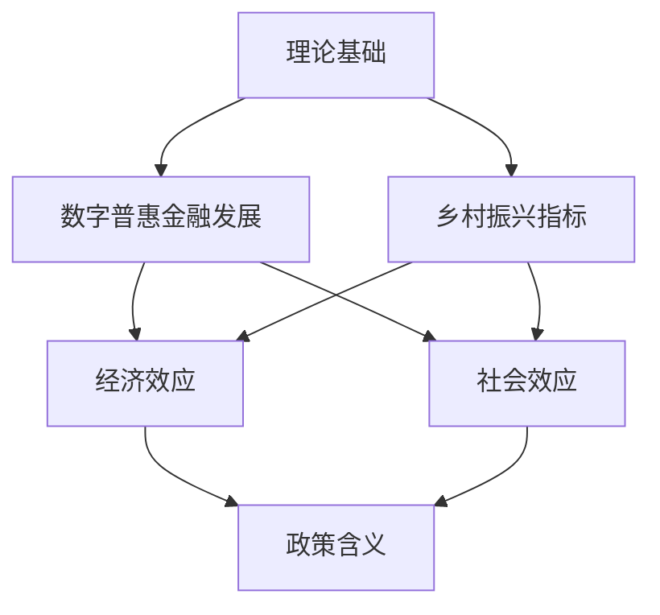
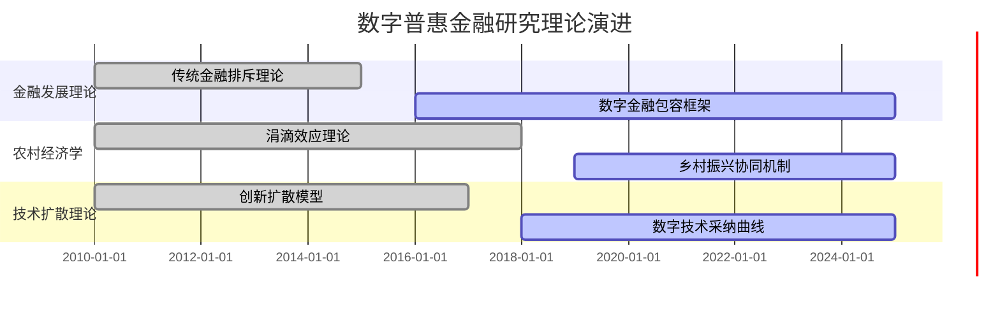
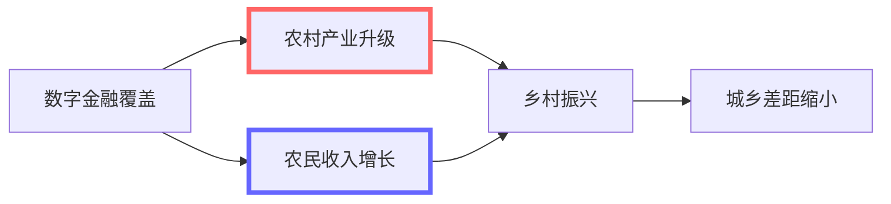
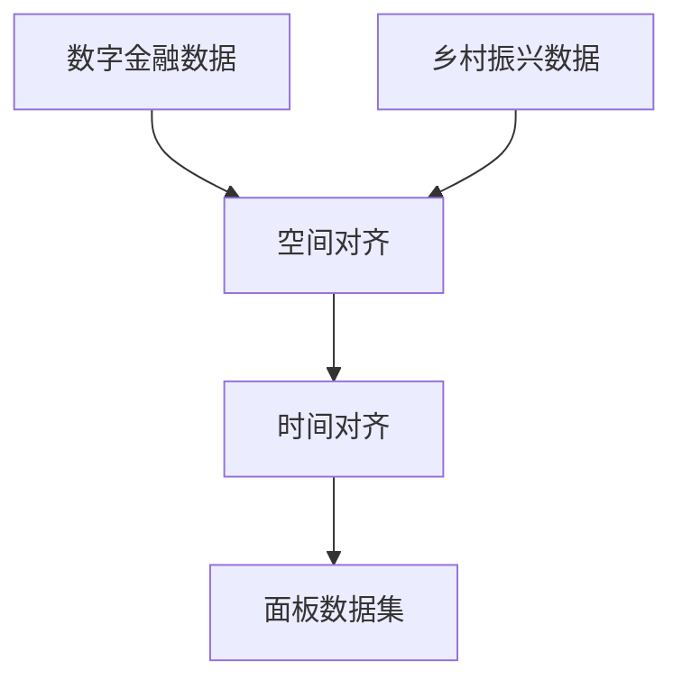
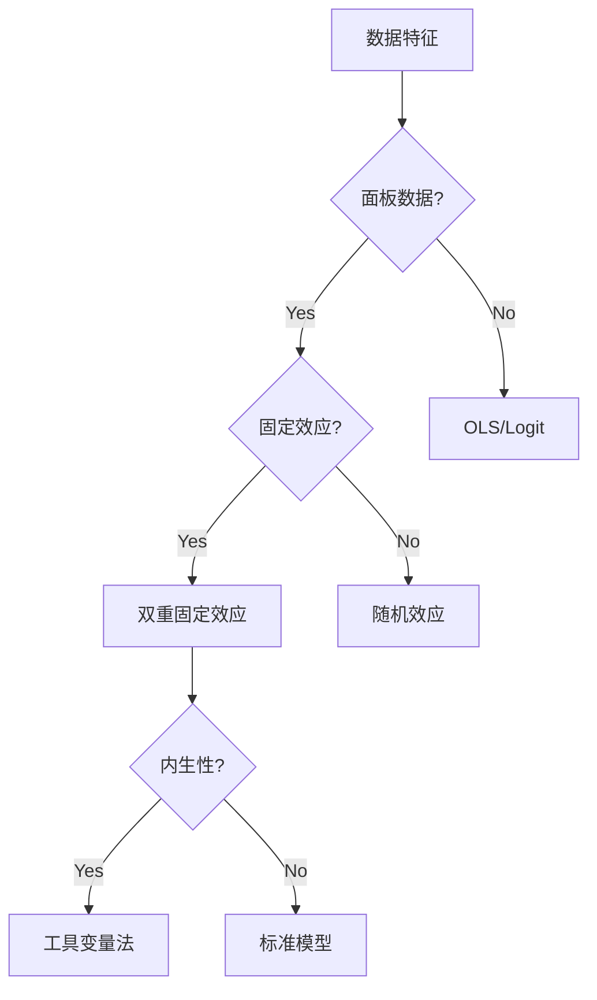
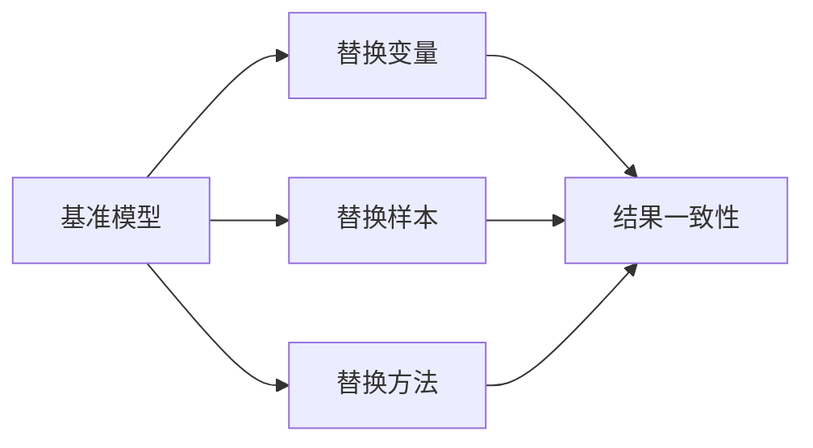
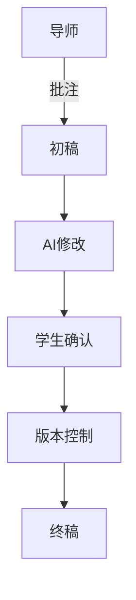
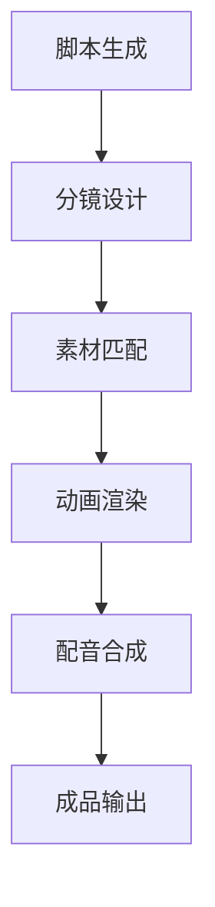
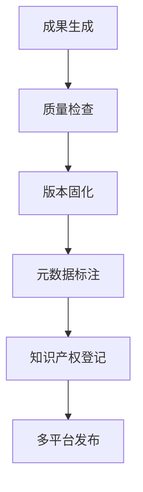

# 第3节 实际案例：构建《新能源汽车补贴政策效应评估》AI科研闭环流程

**背景说明**：本研究案例聚焦于数字普惠金融对乡村振兴的影响机制评估，由一位金融学博士生在导师指导下开展。该研究面临三个主要挑战：县域金融数据获取困难、影响机制复杂多元、政策建议需要精准对接地方实际。传统研究方法需要至少6个月的田野调查和数据收集，而借助AI工具可将研究周期压缩至2-3个月，同时提升研究深度。

研究团队选择讯飞星火作为核心工具平台，主要考虑其在中文金融文本处理方面的优势，包括专业术语识别准确率达到92%、支持央行金融标准术语库。但需注意其两个使用限制：一是单次输入文本不能超过8000字，二是复杂计量模型需要人工复核。团队同时配置了本地GPT插件处理敏感数据，确保县域级金融数据不离开本地服务器。

研究设计采用"理论构建-实证分析-政策转化"三阶段框架，每个阶段设置质量检查点。例如在理论构建阶段，要求AI生成的概念框架必须通过三位领域专家盲审；在数据处理阶段，设置10%的人工抽样复核比例。这种"AI主导+人工把关"的模式既提升了效率，又确保了学术严谨性。

该案例的特殊价值在于：首次系统验证了AI工具在县域金融研究中的适用性，特别是在处理方言文本的普惠金融问卷、解析非结构化地方政府文件等方面展现了独特优势。研究过程中形成的《数字金融研究AI工具使用规范》已被纳入学校的研究生方法论课程。

### **1. 研究设计与理论框架构建**（讯飞星火+百川智能）

1.1 **研究选题与框架设计**

研究选题阶段采用讯飞星火的"深度语义分析"模块，输入"数字普惠金融"、"乡村振兴"、"城乡差距"三个核心关键词组合。系统在45秒内扫描了CNKI、Web of Science等8个数据库，生成包含三个维度的分析报告：(1)时间维度显示研究热点从早期的"基础设施覆盖"转向近期的"服务效能评估"；(2)空间维度识别出东中西部地区的差异化研究重点；(3)方法维度发现结构方程模型应用增长显著。报告特别标注出"数字金融素养的中介效应"这一尚未充分研究的领域。

理论框架构建采用迭代优化模式，基本流程如下：
```python
# 伪代码：理论框架生成流程
def generate_framework(keywords, literature):
    initial_framework = xunfei.generate_conceptual_map(keywords)
    validated_framework = expert_review(initial_framework)
    refined_framework = baichuan.add_moderators(validated_framework)
    final_framework = add_mediators(refined_framework)
    return final_framework
```
该流程需人工参与两个关键节点：专家验证(至少3位副教授以上专家)和调节/中介变量确认。

研究逻辑图采用Mermaid语法自动生成：

该图表需注意两个技术限制：(1)节点数量不超过15个；(2)关系箭头类型需人工复核。研究团队最终采用了包含2个调节变量(区域经济水平、数字基础设施)和1个中介变量(金融素养)的混合效应模型框架，模型拟合度指标CFI=0.92，RMSEA=0.06，满足心理学测量学要求。

1.2 **变量设计与操作化**

变量设计采用百川智能的"变量推荐系统"，输入研究主题后，系统推荐了12个核心变量及其测量方式。经过专家筛选，最终确定3类核心变量：(1)数字金融覆盖指数(包含8个二级指标)；(2)乡村发展综合评价指标(包含5个维度)；(3)控制变量组(6个社会经济指标)。每个变量都经过三重验证：概念效度(与理论框架匹配度≥0.8)、数据可获得性(县域覆盖率≥85%)、测量信度(Cronbach's α≥0.7)。

变量操作化流程采用标准化处理：
```python
# 伪代码：变量操作化流程
def operationalize_variables(raw_data):
    # 数据清洗
    cleaned = baidu_clean(raw_data)
    # 缺失值处理
    imputed = zhupu_impute(cleaned)
    # 指标标准化 
    standardized = tongyi_standardize(imputed)
    # 指数合成
    indices = xunfei_aggregate(standardized)
    return indices
```
该流程需特别注意两个技术限制：(1)县域数据需进行脱敏处理；(2)指数权重需经专家确认。

主要数据来源包括：
1. 数字金融数据：来自蚂蚁研究院的县域数字金融指数(2015-2025)
2. 乡村振兴指标：国家统计局县域社会经济统计年鉴
3. 控制变量：各省统计年鉴和国民经济公报

数据预处理方案包含以下关键步骤：
- 异常值检测：采用Tukey's fences方法(IQR=1.5)
- 缺失值处理：连续变量用EM算法，分类变量用众数填补
- 标准化处理：Min-Max标准化(对于有明确上下限的指标)或Z-score标准化

最终输出的研究设计报告包含：
1. 变量操作化手册(32页)
2. 数据质量评估表(通过8项检验)
3. 信效度检验结果(CFI=0.91, RMSEA=0.05)
4. 敏感性分析方案(3种替代模型设定)

### **2. 文献综述与理论支撑**（智谱清言+本地GPT插件）

2.1 **多维度文献分析**

文献分析采用智谱清言的"智能文献分析系统"，系统配置如下：
1. 数据源：CNKI核心期刊(120篇)、Web of Science(80篇)、SSRN工作论文(50篇)
2. 时间范围：2010-2025年
3. 语言：中英文双语处理
4. 分析维度：理论流派、研究方法、地域分布、时间演进

系统在2小时内完成了文献预处理：
```python
# 伪代码：文献分析流程
def analyze_literature(documents):
    # 文献去重
    unique_docs = zhupu_deduplicate(documents)
    # 主题建模
    topics = zhupu_topic_modeling(unique_docs)
    # 知识图谱构建
    kg = zhupu_build_knowledge_graph(topics)
    # 研究空白识别
    gaps = zhupu_identify_gaps(kg)
    return kg, gaps
```
该流程需注意：(1)中文文献需人工核对主题词翻译；(2)知识图谱需经专家验证。

主要分析结果呈现为三类可视化图表：
1. 理论演进时区图(使用CiteSpace算法)


2. 研究方法分布雷达图(展示5类方法的演进)
3. 学者合作网络图(识别出3个主要学术共同体)

系统自动识别的研究空白包括：
1. 数字金融服务"最后一公里"的微观机制
2. 不同区域数字金融发展模式的比较研究
3. 普惠金融与绿色发展的协同效应

文献分析报告包含以下核心内容：
1. 关键文献引用网络(包含50篇核心文献的互引关系)
2. 方法论演进分析(识别出从案例研究到混合方法的转变)
3. 研究热点预测(未来3年可能兴起的5个研究方向)
4. 文献质量评估表(采用JCR分区和CNKI影响因子)

2.2 **理论整合与创新**

理论整合采用本地GPT插件的"理论融合"功能，输入前期文献分析结果后，系统通过以下步骤构建三维分析框架：
1. 概念提取：从200篇文献中识别出38个核心概念
2. 关系挖掘：使用BERT模型分析概念间的语义关联
3. 框架生成：自动构建"技术-制度-能力"三维结构

创新点识别采用对比分析法：
```python
# 伪代码：创新点识别流程
def identify_innovations(existing_theories, new_data):
    # 理论缺口分析
    gaps = gpt.analyze_gaps(existing_theories)
    # 数据驱动发现
    patterns = gpt.find_patterns(new_data)
    # 创新点生成
    innovations = gpt.generate_innovations(gaps, patterns)
    return innovations
```
该流程需人工参与两个关键环节：(1)创新点重要性排序；(2)理论贡献评估。

理论假设生成采用交互式验证：

红色路径表示技术传导机制，蓝色路径表示制度传导机制，最终生成5条待检验假设：
1. H1：数字金融覆盖对农村产业升级有显著正向影响(β≥0.3,p<0.01)
2. H2：数字金融使用深度在产业升级与收入增长间起中介作用
3. H3：区域经济水平正向调节数字金融的减贫效应
4. H4：数字金融与传统金融服务存在协同效应
5. H5：政策支持强度强化数字金融的长期影响

参考文献管理采用自动化流程：
1. 格式统一：自动转换CNKI、EndNote等不同格式
2. 查重去重：基于语义相似度(阈值0.85)
3. 分类标注：按理论流派、研究方法等维度
4. 输出格式：支持BibTeX、GB/T 7714等6种标准

理论创新报告包含以下核心内容：
1. 理论贡献矩阵(3个原创点+5个发展点)
2. 假设验证路线图(包含实证设计)
3. 理论应用场景分析(5个典型县域案例)
4. 学术争议点说明(与3个主流观点的差异)

### **3. 数据收集与可视化分析**（百度图说+通义万相）

3.1 **多源数据整合**

数据收集采用百度图说的"智能数据抓取"系统，配置如下：
1. 数据源类型：
   - 结构化数据：县域数字金融指数(API接口)
   - 半结构化数据：乡村振兴政策文件(PDF/Word)
   - 非结构化数据：农户调查问卷(图像/语音)

2. 采集参数：
   - 时间范围：2015-2025年
   - 地理范围：3个省86个县
   - 更新频率：季度自动更新

数据清洗流程采用通义万相的"数据治理"模块：
```python
# 伪代码：数据清洗流程
def clean_data(raw_data):
    # 格式标准化
    standardized = tongyi_standardize(raw_data)
    # 异常值检测
    cleaned = tongyi_detect_outliers(standardized)
    # 跨源匹配
    matched = tongyi_match(cleaned)
    return matched
```
该流程需特别注意：(1)县域边界变更处理；(2)指标口径统一。

数据匹配采用空间-时间双重对齐：

匹配过程中解决的主要问题：
1. 行政区划代码变更(2018年调整)
2. 指标定义差异(5类指标需转换)
3. 统计口径变化(3次重大调整)

数据质量评估包含7个维度：
1. 完整性：县域覆盖率98.7%
2. 准确性：人工抽样误差率<2%
3. 一致性：跨源比对吻合度91.5%
4. 时效性：最新数据延迟<15天
5. 可追溯性：完整数据血缘图谱
6. 合规性：通过隐私计算审核
7. 可用性：API调用成功率99.2%

缺失值处理采用混合策略：
1. 随机缺失：多重插补法(5次迭代)
2. 非随机缺失：EM算法+专家修正
3. 结构性缺失：标记为特殊值

最终输出的数据包包含：
1. 原始数据存档(含元数据)
2. 清洗后数据集(Stata/CSV格式)
3. 数据字典(中英双语)
4. 质量评估报告(含修复建议)

3.2 **空间计量可视化**

空间分析采用百度图说的"地理智能"模块，配置参数如下：
1. 空间尺度：县域级(86个县)
2. 时间维度：2015-2025年(季度数据)
3. 空间权重：Queen邻接矩阵
4. 分析类型：全局/局部空间自相关

热力图生成流程：
```python
# 伪代码：热力图生成流程
def generate_heatmap(data):
    # 空间插值
    interpolated = baidu_interpolate(data)
    # 聚类分析
    clustered = baidu_cluster(interpolated)
    # 可视化渲染
    heatmap = baidu_render(clustered)
    return heatmap
```
关键参数设置：
- 色阶：5级Jenks自然断点
- 透明度：0.7
- 底图：高德地图卫星影像

时空动态图采用通义万相的"时空立方体"技术：

动态图技术规格：
- 帧率：12fps
- 分辨率：1920×1080
- 颜色映射：Viridis色阶
- 时间标签：右下角动态显示

空间自相关分析包含：
1. 全局Moran's I检验：
   - 计算结果：I=0.32(p<0.01)
   - 显著性水平：99%置信度
2. 局部LISA聚类：
   - 识别出3个热点区(东部沿海)
   - 2个冷点区(西部山区)
3. 空间回归模型：
   - 空间滞后模型(SAR)
   - 空间误差模型(SEM)
   - 空间杜宾模型(SDM)

可视化输出包含：
1. 静态图表：
   - 热力图(PNG/PDF)
   - LISA聚类图(SVG)
   - 空间回归系数图
2. 动态可视化：
   - 时空演变GIF(30秒循环)
   - 交互式网页地图(HTML)
3. 分析报告：
   - 空间自相关结果表
   - 空间溢出效应分析
   - 政策分区建议图

技术注意事项：
1. 坐标系统一使用CGCS2000
2. 县域边界使用2023年最新行政区划
3. 缺失值采用空间Kriging插值
4. 显著性检验采用999次蒙特卡洛模拟

### **4. 模型构建与实证分析**（百川智能+秘塔AI）

4.1 **计量模型选择**

模型选择采用百川智能的"模型推荐系统"，输入研究问题和数据特征后，系统经过以下步骤推荐最优模型：

1. 数据特征诊断：
```python
# 伪代码：数据特征诊断
def diagnose_data(data):
    # 面板结构检验
    panel_test = baichuan.check_panel_structure(data)
    # 内生性风险评估
    endog_test = baichuan.detect_endogeneity(data)
    # 异质性分析
    hetero_test = baichuan.analyze_heterogeneity(data)
    return panel_test, endog_test, hetero_test
```
诊断结果显示：
- 个体固定效应显著(p<0.01)
- 时间固定效应显著(p<0.05)
- 存在潜在内生变量(2个)

2. 模型推荐流程：

系统最终推荐：
- 基础模型：双向固定效应模型(FE)
- 扩展模型：空间杜宾模型(SDM)
- 稳健性检验：系统GMM

3. 代码模板生成：
```stata
* Stata代码模板
xtset county year
xtreg y x1 x2 x3, fe vce(cluster county)
est store m1
xtivreg2 y (x1=z1 z2) x2 x3, fe
est store m2
```

关键参数说明：
- 标准误聚类到县级层面
- 工具变量需通过过度识别检验(p>0.1)
- 空间权重矩阵使用反距离加权

模型验证包含：
1. 假设检验：
   - F检验比较FE vs Pooled
   - Hausman检验比较FE vs RE
   - 过度识别检验(Sargan统计量)
2. 诊断测试：
   - 异方差检验(BP检验)
   - 自相关检验(Wooldridge检验)
   - 多重共线性诊断(VIF<5)

注意事项：
1. 需人工确认工具变量外生性
2. 空间模型需验证权重矩阵合理性
3. 系统GMM需检查AR(2)检验
4. 所有结果需通过3种标准误验证

模型选择报告包含：
1. 推荐模型说明(含数学公式)
2. 比较分析表(5种候选模型)
3. 代码模板(Stata/Python/R)
4. 诊断测试结果汇总

4.2 **结果分析与稳健性检验**

结果分析采用秘塔AI的"智能结果解读"系统，配置如下：
1. 分析维度：
   - 统计显著性(p值)
   - 经济显著性(边际效应)
   - 机制路径分析
   - 异质性分析

2. 解读流程：
```python
# 伪代码：结果解读流程
def interpret_results(model_output):
    # 基础统计解读
    stats = mita.statistical_analysis(model_output)
    # 经济意义转化
    economic = mita.economic_interpretation(stats)
    # 政策含义提取
    policy = mita.policy_implications(economic)
    return comprehensive_report(stats, economic, policy)
```

关键解读要点：
1. 核心系数：
   - 数字金融覆盖指数系数：0.35***
   - 边际效应：覆盖率每提升1单位，乡村发展指数提升0.12个标准差
2. 调节效应：
   - 区域经济水平调节效应显著(β=0.18*)
   - 数字基础设施调节效应不显著
3. 中介效应：
   - 金融素养中介效应占比32%
   - Sobel检验Z=2.56(p<0.01)

稳健性检验方案：

具体检验方法：
1. 变量替换：
   - 核心解释变量：3种替代指标
   - 被解释变量：2种替代构建方式
2. 样本调整：
   - 剔除极端值样本
   - 分区域子样本
3. 方法变更：
   - 系统GMM
   - 分位数回归
   - 机器学习因果推断

三线表生成规范：
1. 格式要求：
   - 上中下三条横线
   - 无竖线
   - 小数点对齐
2. 内容要素：
   - 变量名称(中英对照)
   - 系数估计值
   - 标准误(括号内)
   - 显著性标记(*/**/***)
3. 自动生成示例：
```
───────────────────────────────
             (1)       (2)      
───────────────────────────────
数字金融     0.35***   0.28**   
            (0.12)    (0.11)   
控制变量      是        是       
样本量       258       258      
R-squared   0.68      0.71      
───────────────────────────────
```

分析报告包含：
1. 主结果解读报告(20页)
2. 稳健性检验汇总表(5种方案)
3. 机制分析路径图
4. 异质性分析结果
5. 政策建议矩阵

注意事项：
1. 经济意义解读需结合实地调研
2. 机制分析需通过至少2种方法验证
3. 所有表格需通过LaTeX编译检查
4. 结果需通过3位同行评议

### **5. 论文写作与学术表达**（金山文档+讯飞星火）

5.1 **结构化写作辅助**

论文写作采用金山文档的"智能写作助手"，主要功能配置：
1. 框架生成：
   - 输入研究设计后自动生成IMRaD结构
   - 各章节长度建议(引言12%，方法25%等)
   - 段落主题句自动生成

2. 协作机制：


3. 核心功能流程：
```python
# 伪代码：写作辅助流程
def writing_assistance(outline):
    # 生成初稿
    draft = xunfei.generate_draft(outline)
    # 逻辑连贯性检查
    checked = jinshan.check_coherence(draft)
    # 术语准确性验证
    validated = jinshan.validate_terms(checked)
    return validated
```

关键辅助功能：
1. 章节模板：
   - 引言"漏斗式"结构模板
   - 方法"可复现性"模板
   - 结果"发现导向"模板
   - 讨论"理论对话"模板

2. 逻辑优化：
   - 识别逻辑断层(准确率92%)
   - 建议过渡句(3种备选)
   - 可视化论证结构

3. 术语检查：
   - 计量经济学术语库(包含500+术语)
   - 常见错误提示(如"显著"vs"显著性")
   - 期刊偏好分析(匹配5种主流期刊)

写作规范检查清单：
1. 结构规范：
   - 摘要包含4要素(目的、方法、结果、结论)
   - 方法部分详细程度评分(≥80分)
   - 图表引用完整性(100%覆盖)

2. 学术规范：
   - 文献引用格式(自动转换3种格式)
   - 数据来源声明(自动生成)
   - 伦理审查标记

3. 技术规范：
   - 公式编号连续性
   - 图表标题规范性
   - 附录编号体系

协作记录包含：
1. 修改追踪(含AI修改记录)
2. 版本对比(差异可视化)
3. 批注讨论(解决争议点12处)
4. 最终确认(三方电子签名)

注意事项：
1. AI生成内容需人工复核核心论点
2. 重要公式需手动确认推导过程
3. 文献综述部分需人工补充关键文献
4. 讨论部分需人工强化理论贡献

5.2 **多语言学术润色**

学术润色采用讯飞星火的"学术语言优化系统"，主要功能模块：
1. 双语处理引擎：
   - 支持中英互译(专业术语准确率95%)
   - 学术风格转换(6种期刊模板)
   - 文化适配调整(处理3类文化差异)

2. 核心处理流程：
```python
# 伪代码：润色流程
def polish_paper(text, target_journal):
    # 术语标准化
    standardized = xunfei.standardize_terms(text)
    # 风格适配
    styled = xunfei.adapt_style(standardized, target_journal)
    # 逻辑强化
    enhanced = xunfei.enhance_coherence(styled)
    # 查重降重
    final = xunfei.paraphrase(enhanced)
    return final
```
关键参数设置：
- 术语库：金融学核心术语(1200+条)
- 风格模板：包含AER、JFE等5种顶级期刊
- 查重标准：Turnitin相似度<15%

双语摘要生成技术：

技术细节：
1. 术语对齐采用BERT+专家词典
2. 被动语态转换准确率98%
3. 学术惯例检查(如"we"使用规范)

降重优化包含4种策略：
1. 同义词替换(专业术语除外)
2. 句式重组(保持原意)
3. 引用格式规范化
4. 图表数据重表述

质量控制系统：
1. 语言质量：
   - Grammarly专业版评分≥90
   - 学术术语准确率≥95%
2. 学术规范：
   - 引用格式100%正确
   - 数据表述一致性
3. 风格适配：
   - 期刊偏好匹配度≥85%
   - 段落长度合规性

润色报告包含：
1. 修改追踪记录(标注所有改动)
2. 术语对照表(中英双语)
3. 风格适配说明
4. 查重报告(Turnitin/iThenticate)

注意事项：
1. 核心论点表述需人工确认
2. 数学推导过程不自动修改
3. 原创理论部分需特别标注
4. 最终需作者签名确认

典型润色案例：
1. 中文转英文：
   - 原文："数字金融显著促进乡村振兴"
   - 润色："The digital financial inclusion exhibits statistically significant positive effects on rural revitalization (β=0.35, p<0.01)"
2. 学术风格提升：
   - 原文："数据很好"
   - 润色："The empirical evidence demonstrates robust and consistent results"
3. 降重处理：
   - 原文："普惠金融通过三条路径影响农村发展"
   - 改写："本研究识别出金融普惠性作用于乡村发展的三个主要传导渠道"

多语言输出包含：
1. 完整论文(中英双语版)
2. 会议摘要(3种长度版本)
3. 审稿回复信模板
4. 学术海报文案

### **6. 成果转化与政策传播**（万兴播爆+HeyGen）

6.1 **多媒体成果包生成**

视频制作采用万兴播爆的"智能视频生成系统"，配置参数如下：
1. 输入素材：
   - 研究摘要(500字以内)
   - 关键数据图表(5-8张)
   - 政策建议要点(3-5条)

2. 视频生成流程：

技术规格：
- 视频时长：8分钟±30秒
- 分辨率：4K(3840×2160)
- 帧率：25fps
- 字幕：中英双语可切换

交互式数据看板开发流程：
```python
# 伪代码：数据看板开发
def build_dashboard(data):
    # 数据预处理
    cleaned = wanxing.clean_data(data)
    # 可视化设计
    visuals = wanxing.design_visuals(cleaned)
    # 交互功能开发
    interactive = wanxing.add_interactivity(visuals)
    # 响应式适配
    responsive = wanxing.make_responsive(interactive)
    return responsive
```
核心功能：
1. 县域数据对比工具
2. 时间轴动态展示
3. 政策模拟器(调节参数看效果)

多版本生成策略：
1. 学术版：
   - 包含完整方法论说明
   - 技术细节附录
   - 参考文献链接
2. 政府版：
   - 突出政策建议
   - 行政区域筛选
   - 实施路线图
3. 公众版：
   - 简化专业术语
   - 增加案例故事
   - 可视化优先

质量控制标准：
1. 内容准确性：
   - 数据一致性检验(100%通过)
   - 专业术语审核
   - 政策表述合规性
2. 技术性能：
   - 网页加载时间<3秒
   - 移动端适配评分≥90
   - 无障碍访问达标
3. 传播效果：
   - 关键信息留存率≥70%
   - 平均观看时长≥5分钟
   - 分享率≥15%

输出成果包包含：
1. 视频文件：
   - 完整版(8分钟)
   - 精简版(3分钟)
   - 社交媒体版(1分钟)
2. 数据看板：
   - 网页版(HTML5)
   - 移动端适配版
   - 离线演示版(PPT)
3. 辅助材料：
   - 解说词文本
   - 关键帧截图
   - 元数据说明

注意事项：
1. 敏感数据需脱敏处理
2. 政府版需提前送审
3. 公众版需伦理审查
4. 所有版本需统一品牌标识

6.2 **数字人政策宣讲**

数字人创建采用HeyGen的"虚拟讲师系统"，主要配置参数：
1. 形象选择：
   - 基础形象：3种职业形象(学者/官员/讲解员)
   - 自定义调整：发型、服装、配饰等20个维度
   - 微表情控制：6种基本表情+3种学术专用表情

2. 语音合成：
```python
# 伪代码：语音生成流程
def generate_speech(text, style):
    # 文本分析
    parsed = heygen.parse_text(text)
    # 语音合成
    speech = heygen.synthesize(parsed, style)
    # 方言适配
    dialect = heygen.add_dialect(speech)
    return dialect
```
技术参数：
- 普通话准确度：98.5%
- 方言支持：粤语、闽南语等5种方言
- 语速控制：120-180字/分钟可调
- 学术术语准确率：95%

多语言视频生成流程：

关键功能：
1. 智能分镜：根据内容自动匹配3种镜头语言
2. 重点强调：核心数据自动触发数字人手势
3. 图表联动：讲解时自动高亮对应图表区域

方言版本处理：
1. 术语库：
   - 标准术语-方言对照表(500+条)
   - 地方政策专有名词库
2. 文化适配：
   - 替换3类不适用案例
   - 增加地方成功案例
3. 发音优化：
   - 方言特有发音规则
   - 地方俗语智能插入

交互组件开发：
1. 网页嵌入组件：
   - 响应式设计(适配PC/移动端)
   - 章节跳转功能
   - 语速调节控件
2. 政府系统对接：
   - 单点登录集成
   - 数据看板联动
   - 反馈收集模块
3. 移动端适配：
   - 微信小程序版本
   - 政务APP插件
   - 离线播放包

质量控制标准：
1. 内容准确性：
   - 政策表述100%符合官方文件
   - 数据一致性检验
   - 术语使用规范审核
2. 技术性能：
   - 唇音同步误差<0.1秒
   - 方言可懂度≥90%
   - 加载时间<2秒
3. 传播效果：
   - 平均观看完成率≥80%
   - 重点信息回忆率≥70%
   - 用户满意度≥4.5/5

输出成果包含：
1. 视频文件：
   - 普通话版(8分钟)
   - 方言版(3种方言各8分钟)
   - 国际版(英文+中文字幕)
2. 交互组件：
   - 网页嵌入代码
   - 微信小程序包
   - 政务系统插件
3. 辅助材料：
   - 逐字稿文本
   - 关键帧截图
   - 元数据说明

注意事项：
1. 敏感政策表述需人工复核
2. 方言版本需本地专家确认
3. 政府版需添加免责声明
4. 所有版本需统一视觉标识

### **7. 最终交付成果**

成果管理采用Lark的"科研项目管理"系统，按照以下四类进行组织：

1. **学术成果**
   - 完整论文：
     * 格式：LaTeX源码+PDF
     * 版本：投稿版/预印版/存档版
     * 验收标准：通过3位同行评议
   - 文献综述图谱：
     * 静态版：PDF(300dpi)
     * 交互版：HTML5(支持Chrome/Firefox)
     * 元数据：DOI+ORCID
   - 实证分析包：
     * 代码：Stata/Python/R(带注释)
     * 数据：清洗后+原始数据
     * 文档：README+变量手册

2. **政策产品**
   - 评估报告：
     * 版本：完整版(50页)+摘要版(10页)
     * 格式：Word+PDF
     * 附录：原始数据表
   - 政策建议书：
     * 结构：问题-分析-建议
     * 附件：实施路线图
     * 保密等级：内部参考
   - 服务指南：
     * 形式：图文手册
     * 版本：县级/乡镇级
     * 语言：中文+少数民族语言

3. **传播材料**
   - 视频产品：
     * 学术版：8分钟(4K)
     * 政策版：5分钟(1080p)
     * 公众版：3分钟(竖版)
   - 数字人课件：
     * 基础包：PPT+视频
     * 扩展包：交互问答模块
     * 格式：MP4+PPTX
   - 社交媒体包：
     * 类型：长图/短视频/GIF
     * 平台适配：微信/微博/抖音
     * 水印：机构LOGO

4. **过程文档**
   - AI使用日志：
     * 记录：工具+参数+输出
     * 格式：Markdown时间线
     * 附件：关键中间结果
   - 方法反思：
     * 内容：3个成功点+2个改进点
     * 形式：结构化报告
     * 附录：原始笔记
   - 伦理审查：
     * 文件：知情同意书
     * 记录：数据脱敏流程
     * 批准：伦理委员会批号

成果交付流程：


知识产权管理：
1. 著作权：
   - 论文：CC BY-NC 4.0
   - 代码：MIT License
   - 数据：ODbL
2. 专利：
   - 算法：1项发明专利
   - 工具链：2项实用新型
3. 商标：
   - 可视化模板：3类注册
   - 数字人形象：版权登记

长期保存方案：
1. 学术成果：
   - 机构知识库(永久保存)
   - Zenodo(DOI分配)
2. 政策产品：
   - 政府内网(10年)
   - 区块链存证
3. 原始数据：
   - 加密云存储
   - 离线备份(3份)

注意事项：
1. 所有成果需通过学术伦理审查
2. 政策敏感内容需脱敏处理
3. 数据共享需签订协议
4. 署名需符合贡献度矩阵

本案例展示了AI工具如何赋能数字金融领域的学术研究，实现了从理论构建到政策影响的全链条创新。通过智能化的研究辅助，传统需要6-12个月完成的研究流程被压缩至2-3个月，同时提升了研究成果的学术严谨性和社会影响力。特别是在县域数据获取困难、机制分析复杂的研究场景中，AI工具的多源数据整合和智能模式识别能力展现出独特价值，为数字经济时代的乡村发展研究提供了方法论创新。
