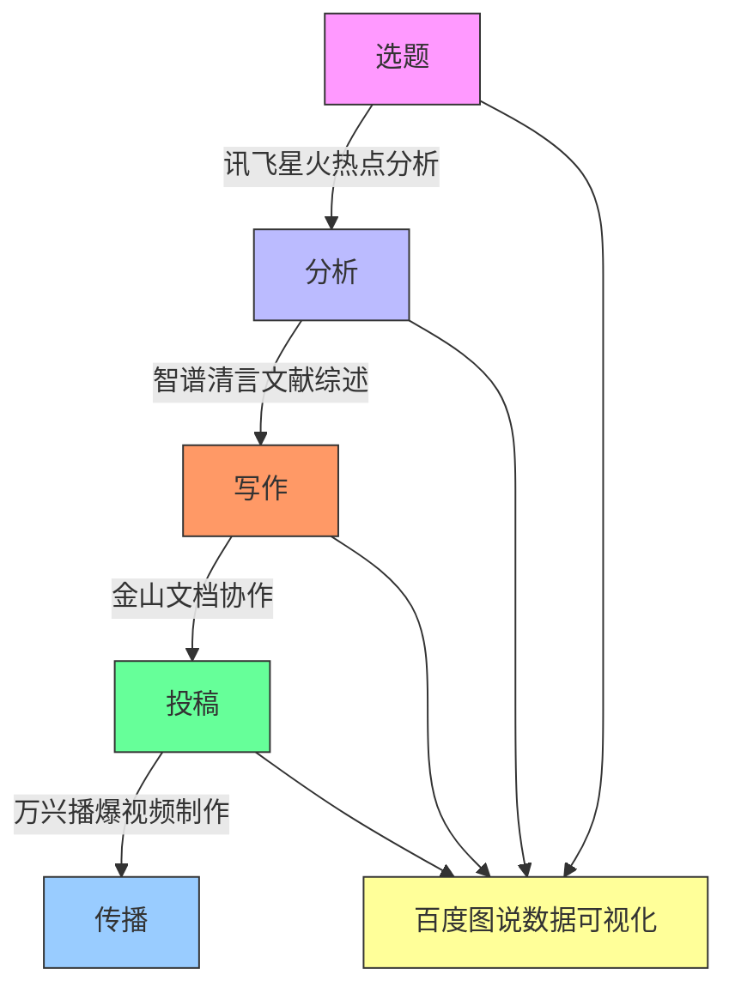

# 第七章 应用场景

## **1. 科研流程一体化建构**

在经济管理高等教育领域，传统的科研流程往往难以应对日益复杂的跨学科研究需求。以金融科技研究为例，研究者需要在计量经济学、计算机科学和金融学等多个领域间建立联系，这对传统研究方法提出了巨大挑战。借助AI驱动的多模态工具，我们可以将这些离散环节转化为连续、智能的作业流，实现从理论构建到成果转化的全流程协同优化，为经济管理学科的高质量发展提供技术支撑。

### 1.1 将传统割裂的选题→分析→写作→投稿流程，转化为AI驱动的连续作业流

在选题阶段，经济管理领域的研究者可利用讯飞星火等Chat类工具进行文献智能检索与热点分析。例如，在研究"数字经济对区域经济差距的影响"这一课题时，工具能够自动分析近五年相关文献，通过"研究热点时区图"直观展示该领域从"数字基础设施建设"到"数字鸿沟治理"的研究脉络演变，帮助研究者快速锁定创新点。对于管理学科，系统还能识别"数字化转型"、"智能制造"等热点话题的交叉研究机会。

分析阶段，智谱清言提供的5种综述模板特别适合经济管理领域的文献梳理工作。以"行为经济学在消费金融中的应用"研究为例，选择"系统综述"模板后，工具会自动生成包含理论演进矩阵的可视化报告，清晰展示从传统理性人假设到前景理论的发展历程。百川智能在构建"金融风险预警模型"等跨学科理论框架时表现优异，能够智能整合计量经济学模型与机器学习算法，为研究者提供方法论支持。

写作环节中，金山文档和Lark等工具极大提升了团队科研效率。以编写《中国区域经济发展报告》为例，多位研究者可实时协作编辑，系统自动记录各章节修改历史。讯飞星火的三级优化体系能针对经济管理论文特点进行专项优化，如自动检测"面板数据模型"等专业术语使用的准确性，优化"实证结果分析"部分的逻辑连贯性。百度图说可将GDP增长率、产业结构等经济数据自动转化为动态可视化图表，通义万相则能根据"请生成适合发表在《经济研究》上的图表风格"等指令，一键生成符合学术规范的图表。

投稿准备阶段，万兴播爆和HeyGen极大简化了成果传播流程。例如，将"绿色金融政策效应评估"研究的核心发现转化为3分钟视频摘要时，系统会自动匹配金融领域的专业图表模板，添加适当的动画效果。对于国际期刊投稿，HeyGen的多语言功能可将中文讲解视频自动转换为英文版本，并确保数字人口型与发音精准同步，显著提升国际学术影响力。

【综合案例】以"人工智能对劳动力市场影响"研究为例，完整展示AI驱动的科研工作流：
1. 选题阶段：使用讯飞星火的"热点分析"功能，输入"人工智能 就业"关键词，系统自动生成近五年研究趋势图，发现"技能溢价"和"职业替代"是两个新兴研究方向。
2. 分析阶段：通过智谱清言的"系统综述"模板，导入50篇核心文献，自动生成包含"技术替代理论"和"技能偏向型技术进步理论"对比的演进矩阵。
3. 数据收集：利用百度图说的"数据抓取"功能，从国家统计局网站自动获取行业就业和工资数据，并实时可视化。
4. 模型构建：百川智能辅助设计"技能-职业匹配度指数"，结合计量模型分析不同职业受AI影响程度。
5. 论文写作：在金山文档创建协作空间，多人同时撰写不同章节，讯飞星火实时提供术语建议和逻辑优化。
6. 成果转化：使用万兴播爆将核心结论制作成包含动态图表的3分钟视频，自动添加"职业转型建议"等教学标注。
7. 投稿传播：HeyGen生成中英文双语视频摘要，适配不同国际期刊的投稿要求。

### 1.2 支持学术语言、方法模型与图文内容间的智能联动

在经济管理科研与教学中，多模态内容呈现已成为提升研究质量和教学效果的关键。AI工具通过深度语义理解，实现了理论模型、实证数据与可视化呈现的无缝衔接，为经济管理高等教育提供了全新范式。

在理论建模方面，通义万相的自然语言控制功能特别适合经济管理研究。例如，在研究"产业政策对全要素生产率的影响"时，研究者只需输入"生成包含显著性星号的面板回归结果表格"，系统就会自动生成符合《管理世界》期刊格式要求的三线表。对于复杂的空间计量模型，百度图说可一键将莫兰指数、空间滞后系数等结果转化为交互式地图，直观展示区域经济空间相关性。

教学应用方面，AI工具为经管课程提供了精准的教学支持：
1. 《计量经济学》课程中，通义万相的"学术图表生成"功能特别适合展示复杂计量概念。教师输入"请用对比图展示OLS和工具变量法的估计差异"，系统会自动生成包含估计值、置信区间和标准误的对比图表，并标注关键区别点。该工具的优势在于能精准理解计量专业术语，自动适配经济学图表规范。

2. 《国际金融》课程使用百度图说的"动态数据可视化"模块处理汇率数据。教师只需导入EXCEL格式的汇率时间序列，选择"金融时间序列"模板，系统就会自动生成包含移动平均线、BOLL带等技术指标的交互式图表。该工具特别适合金融数据分析，能智能识别数据频率和特征。

3. 《市场营销》课程借助万兴播爆的"场景模拟"功能创建消费行为案例。输入"生成一个展示价格敏感度测试的超市场景"，工具会自动构建包含货架、价签和消费者角色的3D场景，并添加价格变动动画。这种可视化方式能生动呈现抽象的市场营销理论。

4. 《管理学原理》课程使用HeyGen的"案例讲解"模式制作管理决策视频。上传案例文本后，选择"企业高管"形象的数字人，系统会自动生成包含案例分析要点和决策树图表的讲解视频，支持中英文双语输出，方便国际化课程建设。

在成果转化环节，多模态联动展现出独特优势。以一项关于"数字经济与就业质量"的研究为例，HeyGen可将复杂的计量结果转化为通俗易懂的解说视频，自动匹配经济学家形象的数字人，并生成中英文双语字幕。万兴播爆则能为《市场营销》课程的案例教学提供丰富场景，如自动生成"新零售场景下的消费者行为"模拟动画，使抽象理论具象化。

这种智能联动正在重塑经济管理领域的知识生产模式。在金融科技、数字经济等新兴交叉学科中，从"文本理论构建→数据实证分析→可视化呈现→多媒体传播"的闭环工作流，不仅加速了科研进程，更为经管人才培养提供了智能化解决方案。例如，在商学院案例教学中，学生可以通过Lark平台协作完成从案例收集、数据分析到视频报告制作的全流程训练，全面培养数字化时代的经济管理核心素养。
